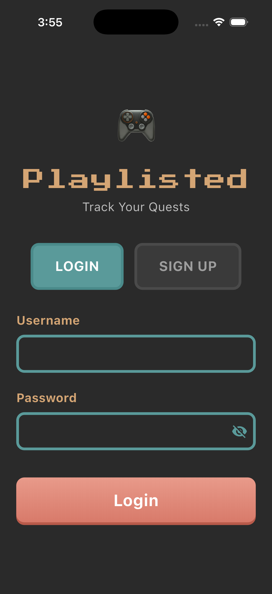
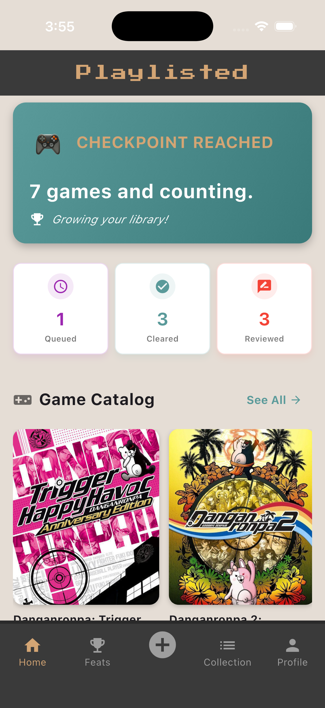
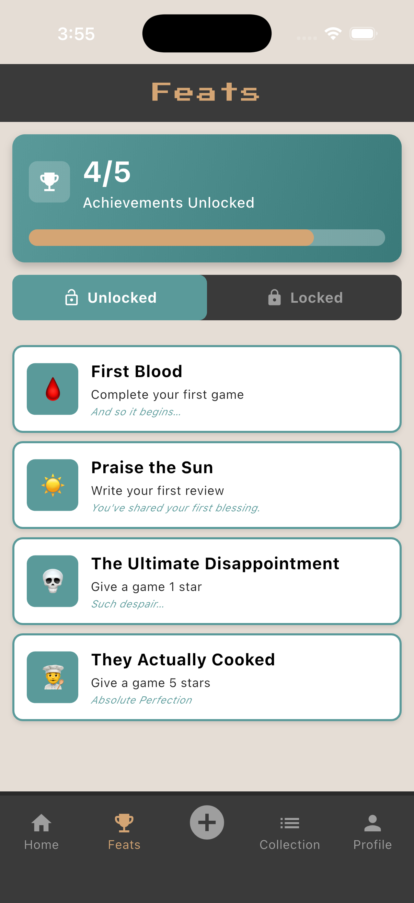
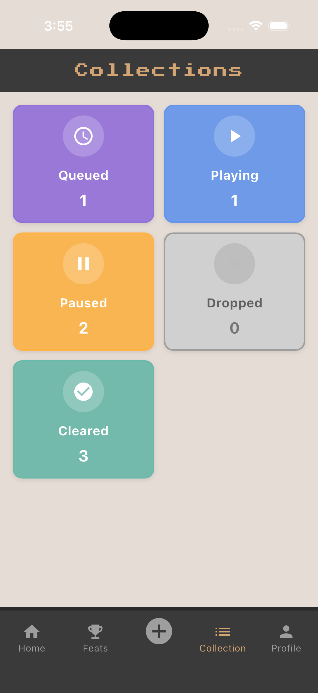
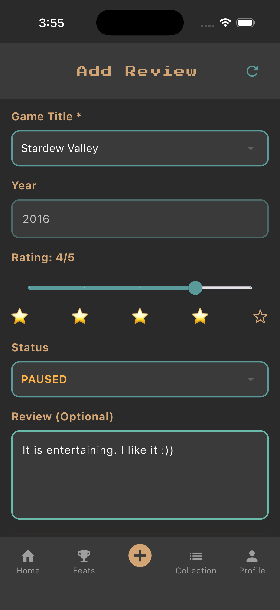
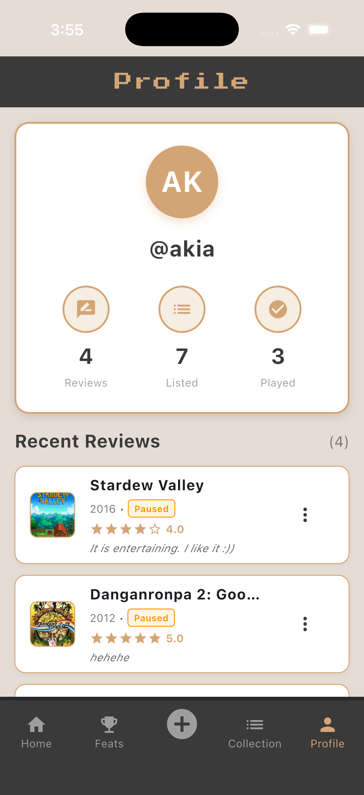

[![style: dart frog lint][dart_frog_lint_badge]][dart_frog_lint_link]
[![License: MIT][license_badge]][license_link]
[](https://dart-frog.dev)

[dart_frog_lint_badge]: https://img.shields.io/badge/style-dart_frog_lint-1DF9D2.svg
[dart_frog_lint_link]: https://pub.dev/packages/dart_frog_lint
[license_badge]: https://img.shields.io/badge/license-MIT-blue.svg
[license_link]: https://opensource.org/licenses/MIT


# Playlisted: A Library for Games

Playlisted is a mobile app for logging, tracking, and reviewing the games you play. Build your personal game library and keep a record of your gaming history.

  


## 🛠️ Prerequisites
Before running this project, ensure you have the following installed:
- Flutter SDK (v3.10 or later)
- Dart Frog CLI
- A working Android Emulator or iOS Simulator

## 🚀 Setup & Installation

### 1. Database Setup (Docker)
- Create a docker-compose.yml file in the project root:
```yaml
version: "3.8"
services:
  db:
    image: postgres:15-alpine
    container_name: playlisted_db
    restart: always
    environment:
      POSTGRES_USER: gamemaster
      POSTGRES_PASSWORD: playlisted123
      POSTGRES_DB: playlisted_db
    ports:
      - "5432:5432"
    volumes:
      - db_data:/var/lib/postgresql/data
```

- Start the PostgreSQL container:
```bash
docker compose up -d
```

- Verify the database is running:
```bash
docker ps
```

### 2. Server Setup
Start the Dart Frog backend with:
```env
dart_frog dev
```
- This will run the backend locally, usually at http://localhost:8080 (or the port defined in .env).
- Make sure your .env file contains the correct database configuration

### 3. Environment Variables
- **Backend .env**  
Required for connecting to PostgreSQL:
```env
DB_HOST=localhost
DB_PORT=5432
DB_NAME=playlisted
DB_USER=playlisted
DB_PASSWORD=password
```

- **Flutter .env**  
Required for API requests from the client:
```env
BASE_URL=http://10.0.2.2:8080   # Android Emulator
BASE_URL=http://localhost:8080   # iOS Simulator
```

### 3. Client Setup
- Navigate to the Flutter project folder:
```bash
cd playlisted
```

- Get dependencies
```bash
flutter pub get
```

- Run the Flutter app
```bash
flutter run
```

## 📱 Features
* **Log Games**: Track the status of games throughout your playthroughs.
* **Write Reviews**: Rate games and leave written reviews.
* **Unlock Achievements**: Unlock milestones for your activity within Playlisted.
* **Backlog Roulette**: Randomly select a game from your backlog to play next.
* **Sync**: Data persists on the local server.

## 🟢 How to Use
* **Login**: Open the app and log in with your username or create a new account.
* **Add Games**: Select a game and update its play status (e.g., queued, playing, completed).
* **Write Reviews**: Choose a game and submit a rating and optional review text.
* **Track Achievements**: View achievements unlocked as you log games and reviews.
* **View Stats**: See your overall gaming activity and progress.

## 📸 Screenshots

### Home Screen
<figure>
  
  <figcaption>Overview of your tracked games</figcaption>
</figure>

### Feats Screen
<figure>
  
  <figcaption>View and unlock in-app achievements for milestones and activity</figcaption>
</figure>

### Collection Screen
<figure>
  
  <figcaption>Browse and organize your personal game library</figcaption>
</figure>

### Write Review
<figure>
  
  <figcaption>Interface for adding a review or notes about a game</figcaption>
</figure>

### Profile Screen
<figure>
  
  <figcaption>User profile screen</figcaption>
</figure>

## 🔗 API Reference
Here are the endpoints available on the Dart Frog server:

| Method | Endpoint | Description |
|--------|----------|-------------|
| GET | `/Users` | List all active users |
| POST | `/Users` | Create new active user |
| PUT | `/Users/[id]` | Update an existing user |
| DELETE | `/Users/[id]` | Delete a user |
| GET | `/Games` | List all active games |
| POST | `/Games` | Add a new game (Requires JSON body) |
| GET | `/Reviews` | Creates a new task (Requires JSON body) |
| POST | `/Reviews` | List all active reviews |
| PUT | `/Reviews/[id]` | Write a new review (Requires JSON body) |
| DELETE | `/Reviews[id]` | Soft delete a review |
| GET | `/UserGames/[id]` | List all logged games for a user |
| POST | `/UserGames` | Log a game for a user |
| PUT | `/UserGames/[userId]` | Update a logged game's status (Requires JSON body) |
| GET | `/UserAchievements/[userId]` | List all achievements for a user |

## 📁 Project Structure
```
Playlisted/
├── playlisted/
│ ├── lib/
│ └── main.dart
├── playlisted_api/
├── screenshots/
│ ├── collections_screen.png
│ ├── feats_screen.png
│ ├── home_screen.png
│ ├── playlisted_preview.png
│ ├── profile_screen.png
│ └── review_screen.png
├── .gitignore
└── README.md
```

## 📄 AI Acknowledgement
AI tools were used during the development of this project to assist with design and implementation decisions.  
AI was specifically used to help create the `UserGames` and `UserAchievements` services, which handle the logic for logging games and triggering achievements.  
AI was used to help modify the test templates, including unit, widget, and API tests.
Additionally, AI assistance was used to help identify and resolve bugs and errors related to both the database and the application code.  
All AI-generated suggestions were reviewed, adapted, and implemented by the developers.
